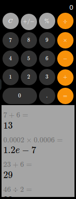
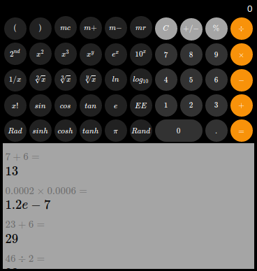

# React Calculator

## Description

A calculator application made with React and Typescript.




## Features

- Basic mathematical operations.
- Keep calculation history within a week in the local storage.

## To be done

- Scientific calculator buttons.

## Usage

```bash
# under ./frontend directory
npm install
npm start
```
